# Part 1. Готовый докер

== Задача ==

- Возьмите официальный образ Docker от nginx и загрузите его с помощью docker pull.

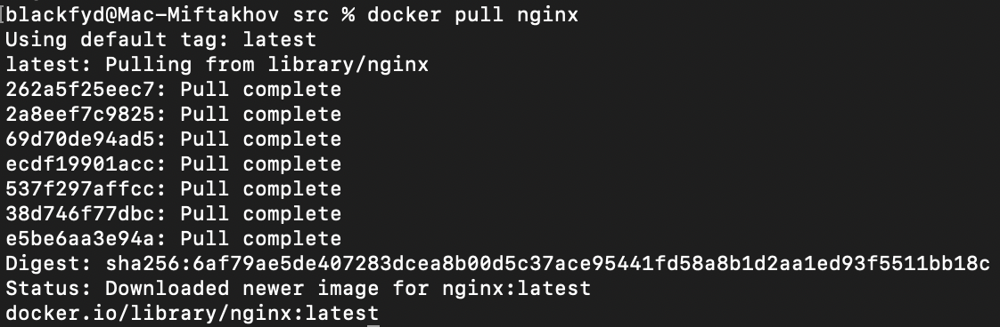

Скачала с помощью команды: docker pull nginx

- Проверьте наличие образа Docker с помощью docker images.

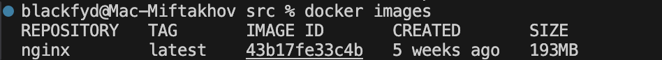

Запустила

- Запустите образ Docker с помощью docker run -d [image_id|repository].

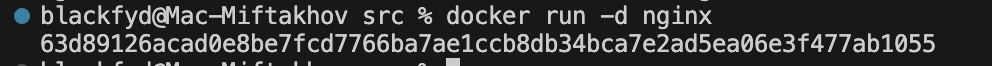

Запустила с помощью команды: docker run -d nginx

- Проверьте, что образ запущен с docker ps.

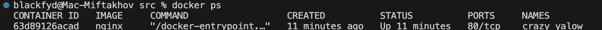

- Просмотр информации о контейнере с помощью docker inspect [container_id|container_name].

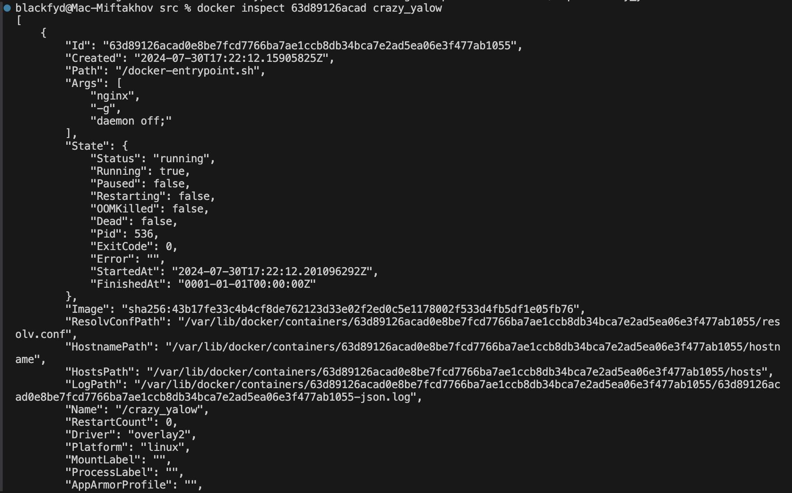

Запустила с помощью команды: docker inspect 63d89126acad crazy_yalow

- Из вывода команды определите и запишите в отчет размер контейнера, список сопоставленных портов и IP-адрес контейнера.

    - размер контейнера:

    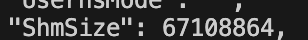

    - список сопоставленных портов:

    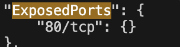

    - IP-адрес контейнера:

    

- Остановите Docker-контейнер с помощью docker stop [container_id|container_name]. Убедитесь, что контейнер остановился docker ps.

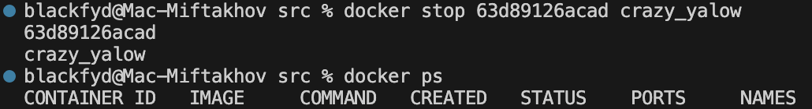

Остановила с помощью команды: docker stop 63d89126acad crazy_yalow. Убедилась с помощью команды: docker ps

- Запустите Docker с портами 80 и 443 в контейнере, сопоставленными с теми же портами на локальной машине, с помощью команды run .

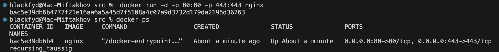

Запустила с помощью команды: docker run -d -p 80:80 -p 443:443 nginx. Убедилась с помощью команды: docker ps

    - p 80:80: указывает Docker связать (маппировать) порт 80, который работает внутри контейнера, с портом 80 на хост-машине. Это означает, что любые запросы, отправленные на порт 80 на хост-машине, будут направлены внутрь контейнера на его порт 80. Это часто используется для веб-серверов, которые слушают на порту 80.

    -p 443:443: аналогично маппирует порт 443 контейнера на порт 443 хост-машины. Порт 443 обычно используется для HTTPS-соединений, так что если Ваше приложение в контейнере поддерживает HTTPS, Вы можете использовать эту опцию для доступа к нему через защищенное соединение.

- Проверьте, доступна ли стартовая страница nginx в браузере по адресу localhost:80 .

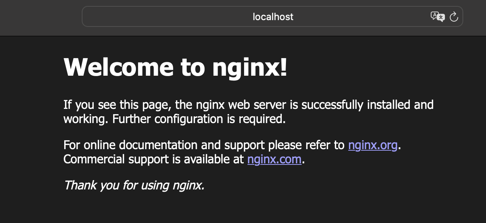

Проверила в Safari

- Перезапустите Docker-контейнер с помощью docker restart [container_id|container_name]. Проверьте любым способом, работает ли контейнер.

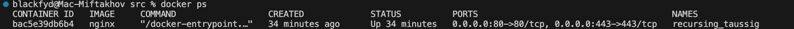

Перезапустила с помощью команды: docker restart 63d89126acad crazy_yalow. И сразу проверила с помощью команды: docker ps. Столбец status показывает, что контейнер перезапустился 5 секунду назад.

- Проверила в Safari, что контейнер запустился с помощью команды: localhost:80

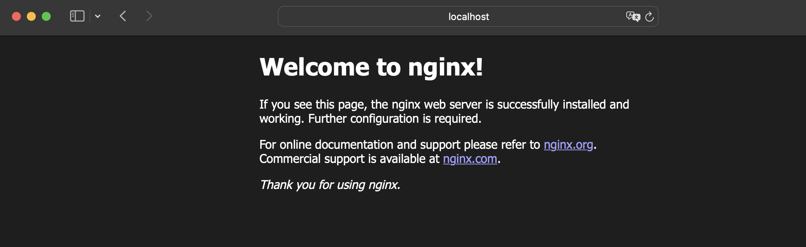

# Part 2. Операции с контейнером

== Задача ==

- Прочитайте файл конфигурации nginx.conf внутри контейнера Docker с помощью команды exec .
    
    - __exec__ позволяет выполнять произвольные команды внутри запущенного контейнера.
    - __sh__ - это запуск стандартной системной оболочки, которая будет использоваться для выполнения команды. Можно использовать bash.
    - __-c__ указывает, что следующий аргумент является командой, которая должна быть выполнена.

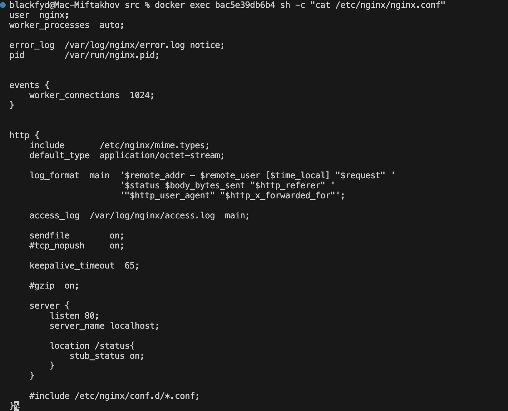

Прочитала файл с помощью команды: docker exec bac5e39db6b4 sh -c "cat /etc/nginx/nginx.conf" 

- Создайте файл nginx.conf на локальной машине. Настройте его в пути /status , чтобы вернуть страницу состояния сервера nginx .

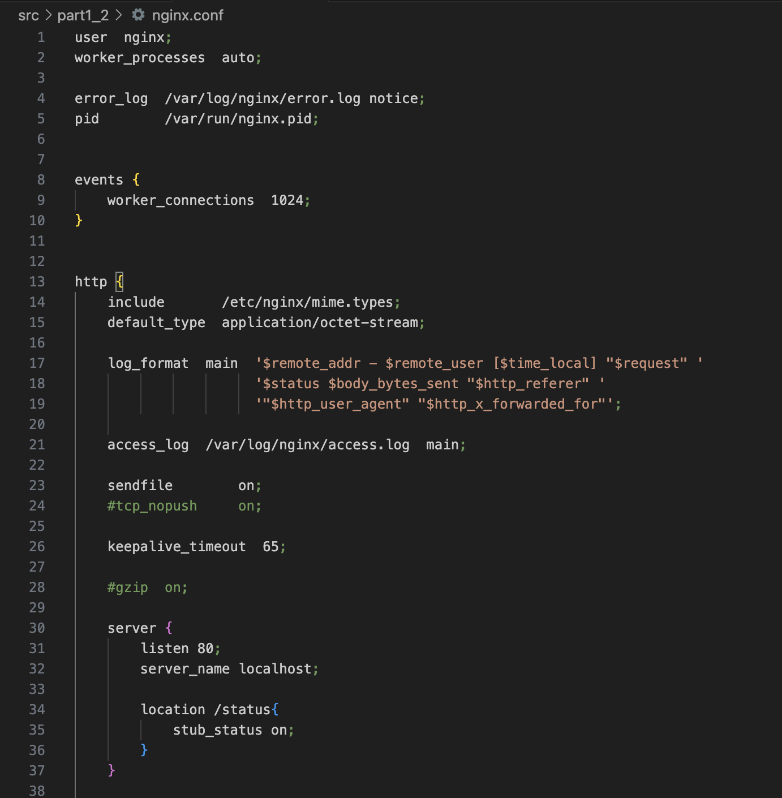

Создала на локальной машине файл _nginx.conf_ и настрола его в пути /status , чтобы вернуть страницу состояния сервера nginx 

- Скопируйте созданный файл nginx.conf в образ Docker с помощью docker cpкоманды.

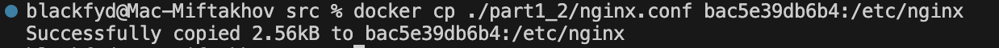

Скопировала с помощью команды: docker cp [filename :/path]. Т.е. docker cp ./part1_2/nginx.conf bac5e39db6b4:/etc/nginx

- Перезапустите nginx внутри образа Docker с помощью exec .

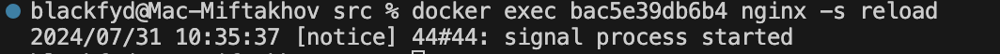

Перезапустила с помощью команды: docker exec nginx -s reload. Т.е. docker exec bac5e39db6b4 nginx -s reload

- Убедитесь, что localhost:80/status возвращает страницу состояния сервера nginx .
    - server accepts handled requests (сервер принимает обработанные запросы):
    общее количество принятых соединений.
    общее количество обработанных соединений.
    общее количество обработанных запросов. 

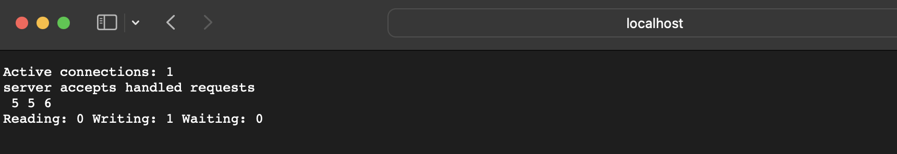
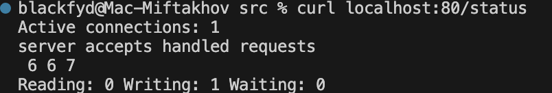

Убедилась в Safari. Команда curl отправляет запросы.

- Экспортируйте контейнер в файл container.tar с помощью команды export .

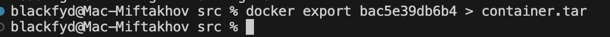

Экспортировала с помощью команды: docker export > filename.tar. Т.е. docker export bac5e39db6b4 > container.tar

- Остановите контейнер.

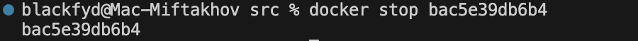

Остановила с помощью команды: docker stop bac5e39db6b4

- Удалите изображение, docker rmi [image_id|repository]не удаляя предварительно контейнер.
    - Команда docker rmi используется для удаления образа Docker

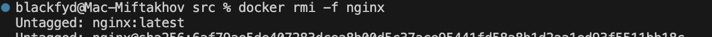

Использовала команду: docker rmi -f nginx, где флаг -f используется для принудительного удаления образа Nginx, даже если он используется другими контейнерами.

- Удалить остановленный контейнер.
    - Команда rm обычно используется для удаления контейнеров, а не образов.

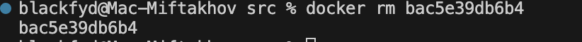

Использовала команду: docker rm bac5e39db6b4

- Импортируйте контейнер обратно с помощью команды import (docker import -c 'CMD ["nginx", "-g", "daemon off;"]' container.tar nginx с названием nginx). 

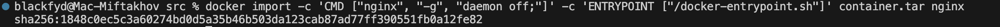

Использовала команду: docker import -c 'CMD ["nginx", "-g", "daemon off;"]' -c 'ENTRYPOINT ["/docker-entrypoint.sh"]' container.tar nginx,
где флаг -c (change), чтобы задать команду запуска Nginx внутри контейнера. Команда CMD ["nginx", "-g", "daemon off;"] указывает, что при запуске контейнера должен быть запущен Nginx в режиме "не в фоне".

- Запустите импортированный контейнер.

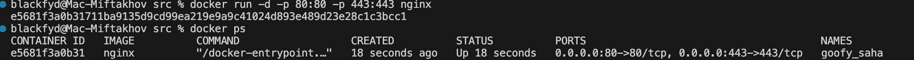

Запустила с помощью команды: docker run -d -p 80:80 -p 443:443 nginx. Проверила с помощью команды: docker ps

- Убедитесь, что localhost:80/status возвращает страницу состояния сервера nginx .

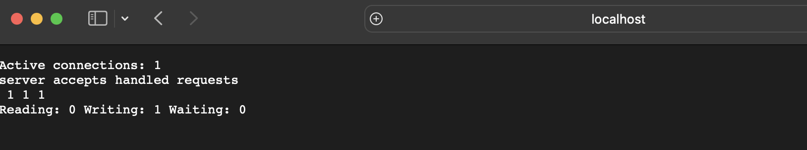

# Part 3.  Мини веб-сервер

== Задача ==

- Напишите мини-сервер на C и FastCgi , который будет возвращать простую страницу с текстом Hello World!.

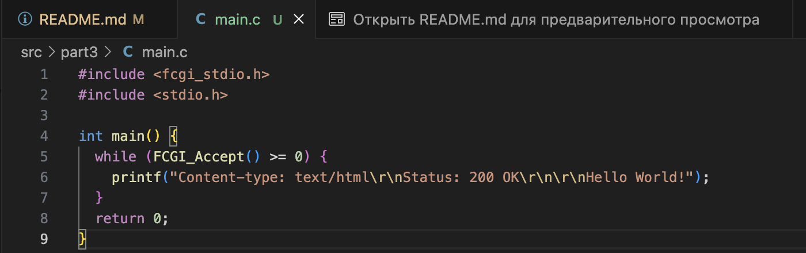

Посмотрела инструкцию  и написала мини-сервер

- Запустите написанный мини-сервер через spawn-fcgi на порту 8080.

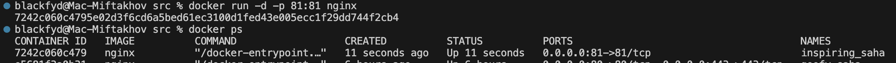

Запустила с помощью команды: docker run -d -p 81:81 nginx. Проверила с помощью команды: docker ps

- Напишите свой собственный nginx.conf , который будет проксировать все запросы с порта 81 на 127.0.0.1:8080 .

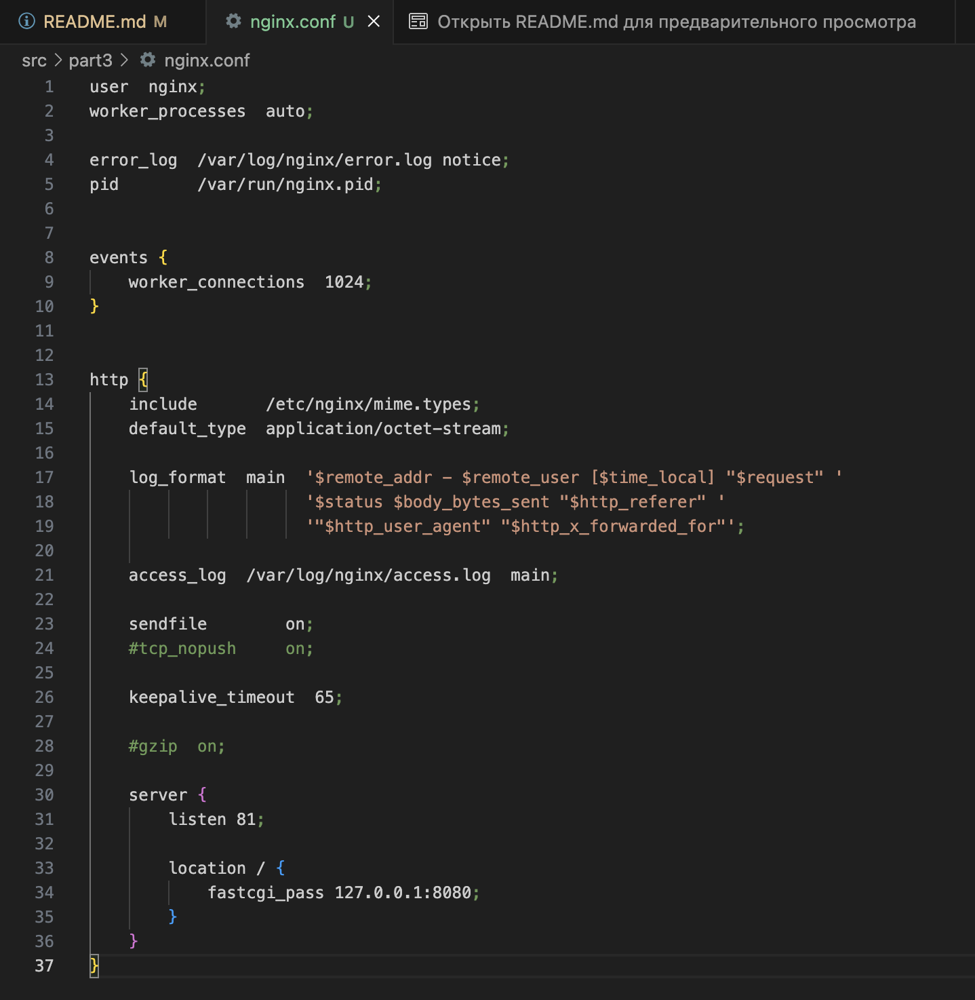

Скопировала в докер командой: docker cp ./part3/nginx.conf inspiring_saha:/etc/nginx и зашла в него

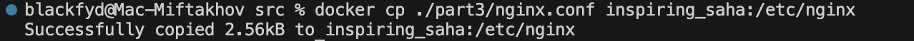

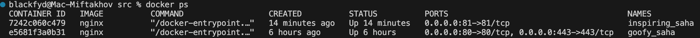

.png)

Зашла внутрь контейнера командой: docker exec -it inspiring_saha /bin/bash

Установила пакеты: apt-get update и apt-get install -y gcc spawn-fcgi libfcgi-dev

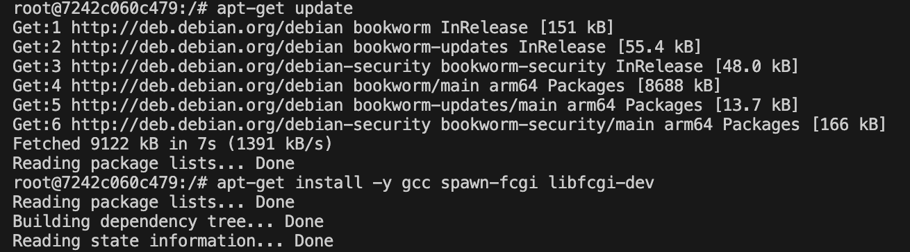

Перешла в HOME, чтобы запустить веб-сервер
Команда gcc -o main main.c -lfcgi компилирует файл main.c в исполняемый файл main
Команда spawn-fcgi -p 8080 ./main запускает FastCGI приложение main, которое будет обрабатывать входящие запросы на порту 8080. 

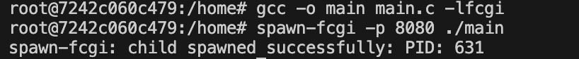

Перезапускаем с помощью команды: nginx -s reload

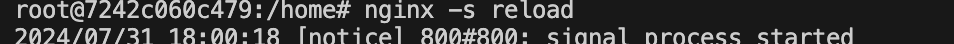

- Проверьте, что браузер на localhost:81 возвращает написанную вами страницу.

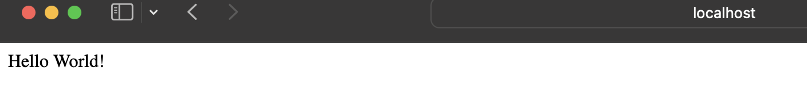

- Поместите файл nginx.conf в папку ./nginx/nginx.conf (он вам понадобится позже).

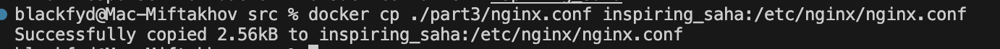

Сделала с помощью команды:  docker cp ./part3/nginx.conf inspiring_saha:/etc/nginx/nginx.conf

# Part 4. Ваш собственный докер

== Задача ==

- Напишите свой собственный образ Docker, который:
    1) собирает исходники мини-сервера на FastCgi из [Части 3](#part-3-mini-web-server);
    2) запускает его на порту 8080;
    3) копирует внутри образа написанный ./nginx/nginx.conf ;
    4) запускает nginx .

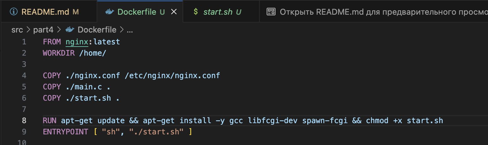
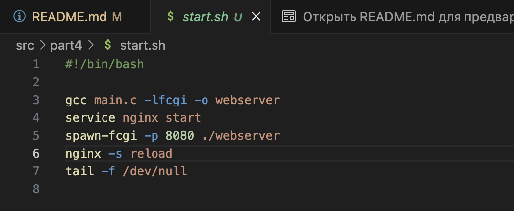

- Создайте записанный образ Docker с помощью docker build, указав имя и тег.

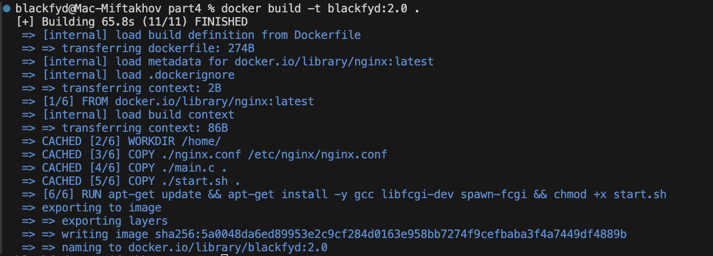

Захожу в папку(part4), где лежит dockerfile, и оттуда выполняю команду: docker build -t blackfyd:2.0 .

- Проверьте, docker images все ли построено правильно.

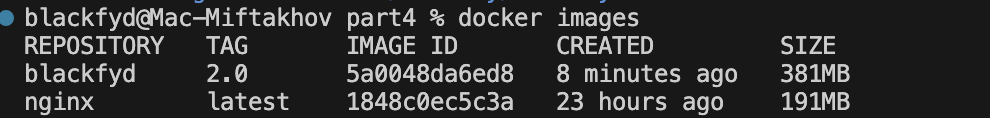

Проверила с помощью команды: docker images

- Запустите созданный образ Docker, сопоставив порт 81 с портом 80 на локальной машине и сопоставив папку ./nginx внутри контейнера с адресом, где находятся файлы конфигурации nginx (см. Часть 2 ).

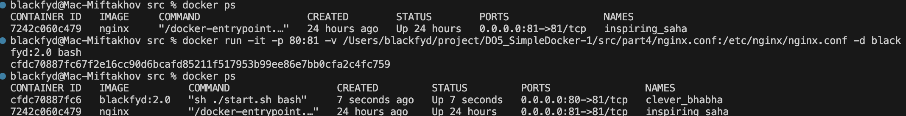

С помощью команды: docker ps проверила не занят ли порт. И запустила с помощью команды: docker run -it -p 80:81 -v /Users/blackfyd/project/DO5_SimpleDocker-1/src/part4/nginx.conf:/etc/nginx/nginx.conf -d blackfyd:2.0 bash

- Проверьте, что страница написанного мини-сервера доступна на localhost:80.

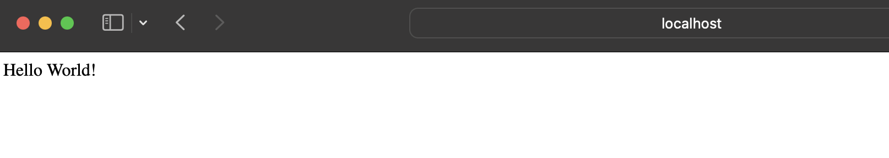

- Добавьте проксирование страницы /status в ./nginx/nginx.conf для возврата статуса сервера nginx .

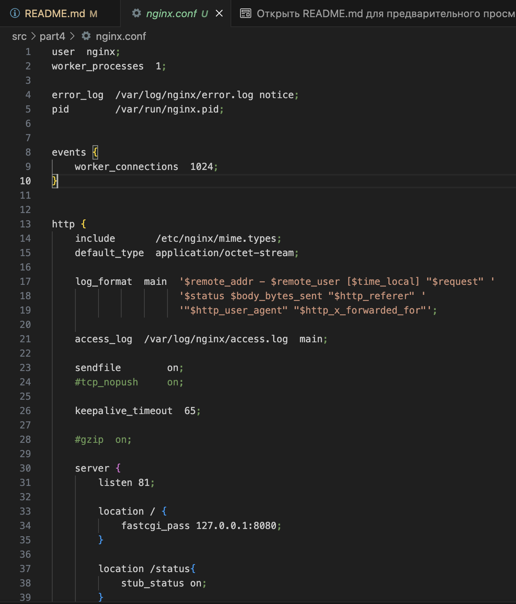

- Перезапустите образ Docker.

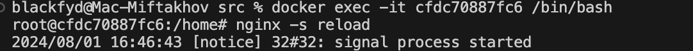

Запустила интерактивную оболочку с помощью команды: docker exec -it cfdc70887fc6 /bin/bash. И перезапустила: nginx -s reload

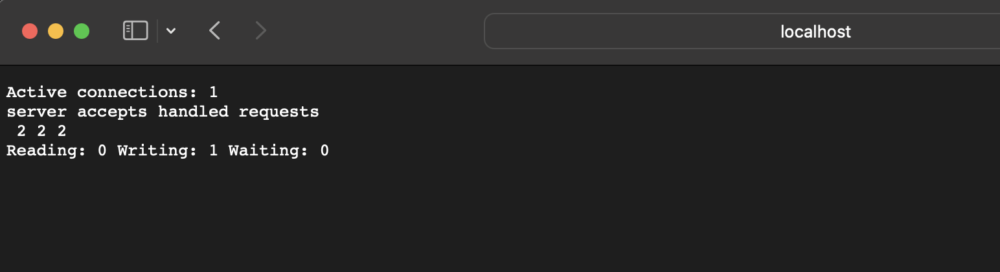

Проверила, что теперь по localhost:80/status отдается страничка со статусом nginx

# Part 5. Dockle

== Задача ==

- Проверьте изображение из предыдущего задания с помощью dockle [image_id|repository].

Установила утилиту docle с помощью команды: brew install goodwithtech/r/dockle

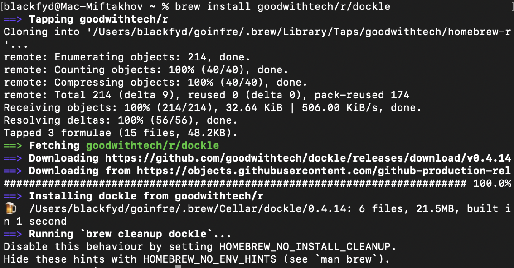

Сохранила контейнер с помощью команды: docker save blackfyd:2.0 -o myblackfyd.tar. 

Использовала команду: dockle --input myimages.tar

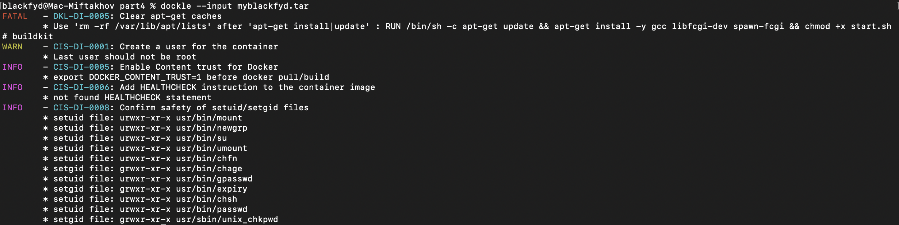

- Исправьте изображение так, чтобы не было ошибок и предупреждений при проверке с помощью dockle .

Новый Dockerfile, nginx.conf и start.sh с исправленными ошибками

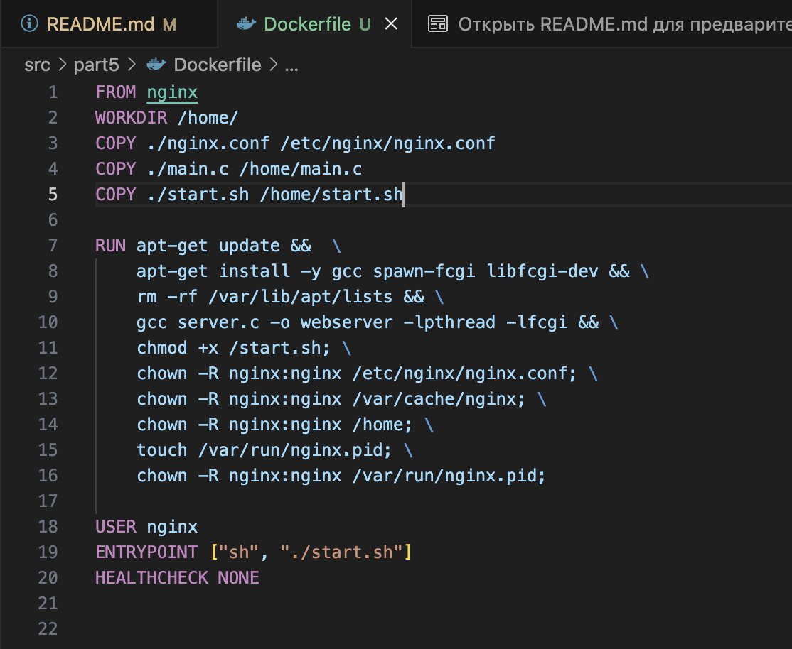

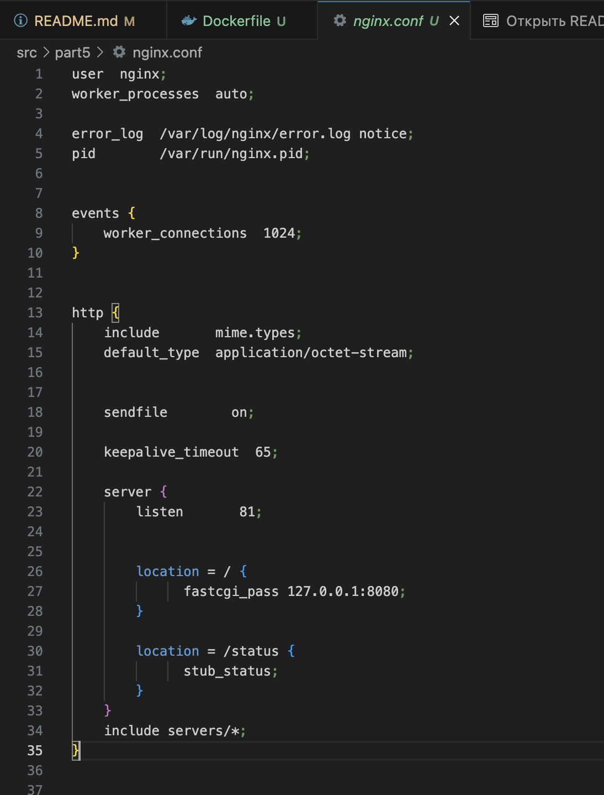

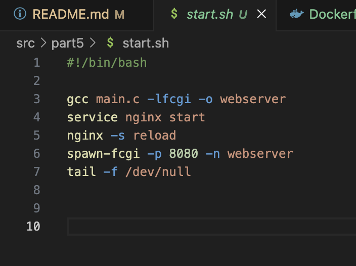

И main.c

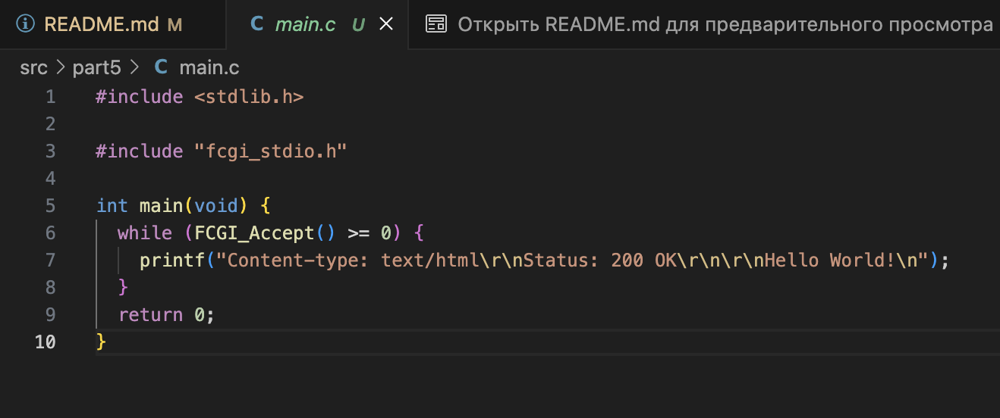

Новый образ через dockle

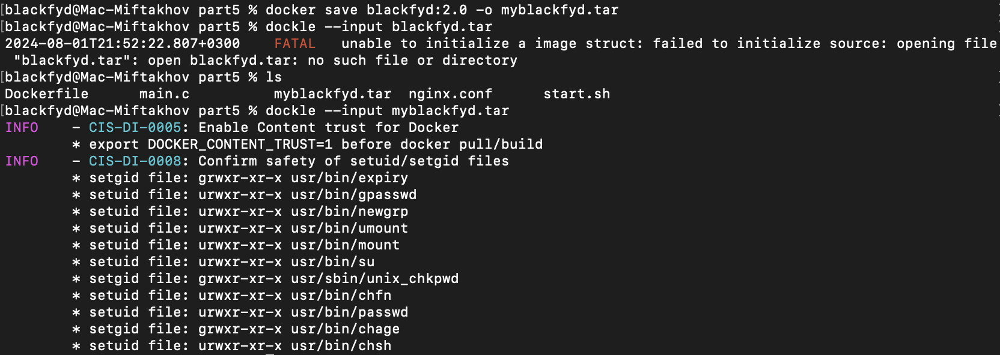

# Part 6. Базовый Docker Compose

== Задача ==

- Напишите файл docker-compose.yml , используя который:
    1) Запустите Docker-контейнер из Части 5 (он должен работать в локальной сети, т. е. вам не нужно использовать инструкцию EXPOSE и сопоставлять порты с локальной машиной) .
    2) Запустите контейнер Docker с nginx , который будет проксировать все запросы с порта 8080 на порт 81 первого контейнера.

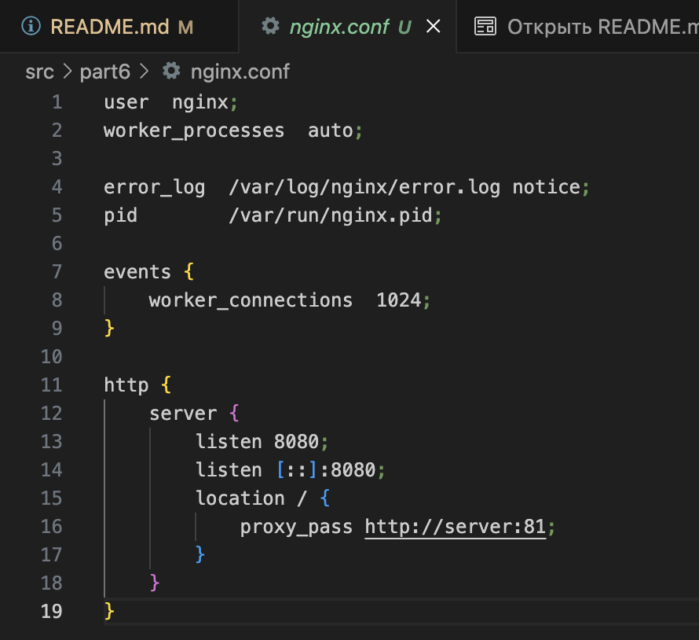

- Сопоставьте порт 8080 второго контейнера с портом 80 локальной машины.

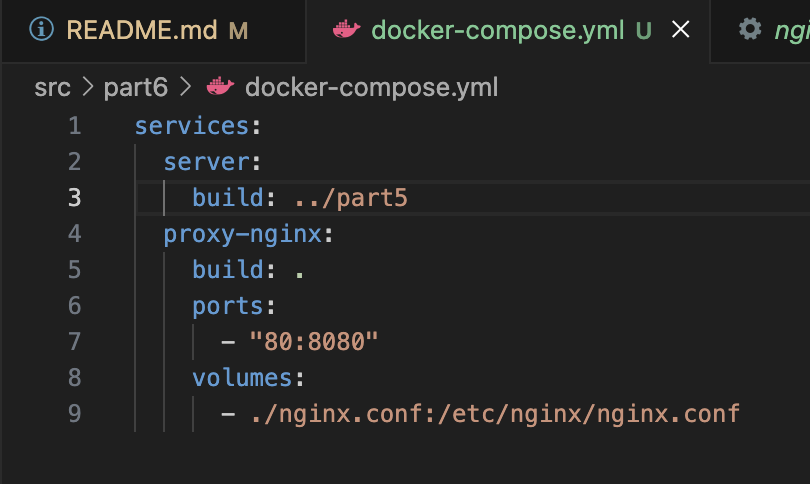

- Остановите все работающие контейнеры.

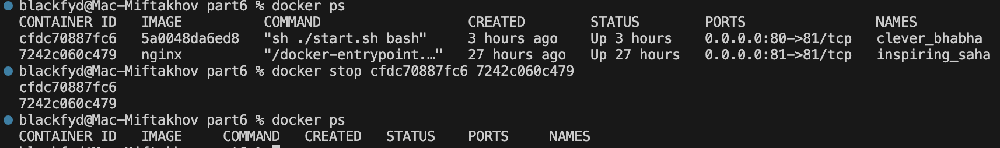

С помощью команды: docker stop cfdc70887fc6 7242c060c479 остановила все работающие контейнеры

- Соберите и запустите проект с помощью команд docker-compose build и docker-compose up.

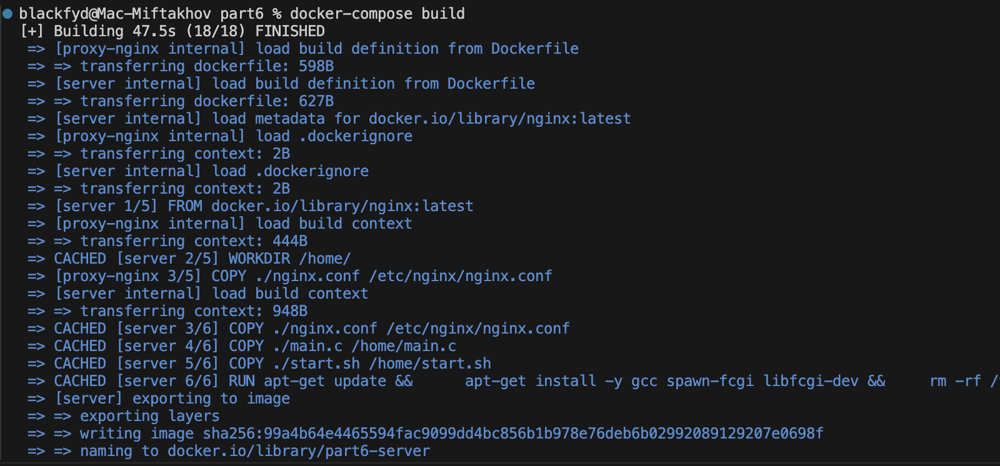

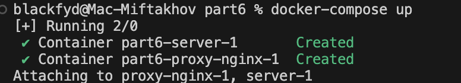

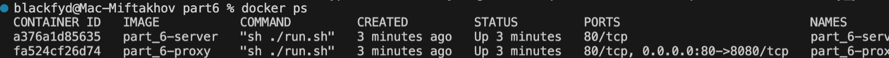

- Убедитесь, что браузер возвращает страницу, которую вы написали на localhost:80, как и раньше.
 
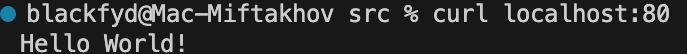